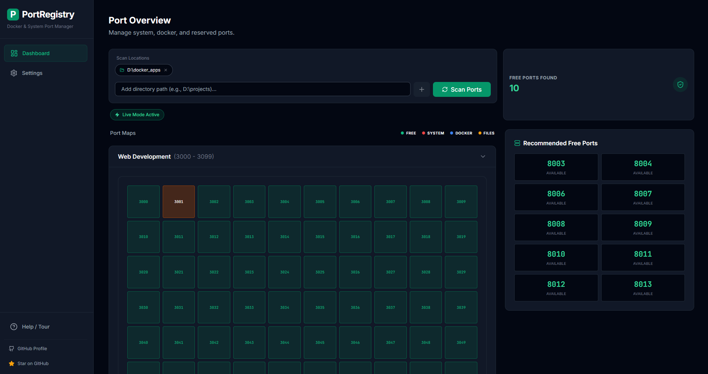

# PortRegistry - Advanced Port Manager

PortRegistry is a powerful utility for developers to manage local ports. It provides a unified view of system processes, Docker containers, and static Docker Compose files, allowing you to identify conflicts and manage your development environment efficiently.

## 🚀 Key Features

*   **Comprehensive Scan**: Detects ports used by:
    *   **System Processes**: Real-time OS process scanning.
    *   **Docker Containers**: Active container mappings.
    *   **Docker Compose Files**: Static analysis of `docker-compose.yml` files on your disk.
*   **Process Management**: **Kill** system processes or **Stop** Docker containers directly from the UI.
*   **Search & Filter**: Instantly find ports by service name, source, or file path.
*   **Desktop App**: Runs as a standalone native window (no browser tab required).
*   **Configurable Port Ranges**: Define custom port ranges in Settings for better organization.
*   **Help/Tour**: Interactive tour to guide you through the application features.

## 🛠️ Architecture

This app uses a **React Frontend** for the UI and a **Python Backend** for system access.

1.  **Frontend (React/Vite)**: Provides the user interface. In development, runs in your browser. In production, runs in a native desktop window.
2.  **Backend (Python/FastAPI)**: Runs locally on your machine. Handles port scanning, process management, and Docker integration via system APIs.

## ▶️ How to use the app
1.  Open the **Dashboard** (default view when the app starts).
2.  Enter your projects folder path (e.g., `D:\docker_apps`) where your Docker Compose files are located.
3.  Click **Scan Ports** to analyze all ports in use.
4.  View the results:
    - **Occupied Ports**: See all ports currently in use by system processes, Docker containers, or Docker Compose files.
    - **Port Grids**: Visual representation of port ranges (default: 3000-3099 and 8000-8099).
    - **Recommended Free Ports**: Click any free port to copy it to your clipboard.
5.  Use **Settings** to configure custom port ranges or access the **Help/Tour** for guided assistance.

## 📦 Installation & Setup

### Prerequisites
*   Node.js (for building the frontend)
*   Python 3.9+ (for the backend agent)
*   Docker Desktop (optional, for container scanning)

### Quick Start (Development)
1.  **Backend**:
    ```bash
    cd back-end
    pip install -r requirements.txt
    python server.py
    ```
2.  **Frontend**:
    ```bash
    npm install
    npm run dev
    ```
    Open `http://localhost:3000`.

## 🛠️ Building the Desktop App

You can package PortRegistry into a single portable `.exe` file that contains both the backend and frontend.

### Method 1: Quick Build (Recommended)
Simply double-click the `build.bat` file or run it from command prompt:
```bash
build.bat
```
This script:
- Builds the frontend (React/Vite)
- Packages everything into a single executable using PyInstaller
- Provides error handling and build verification
- Shows build progress and file size information

### Method 2: Manual Build
```bash
# Build frontend
npm run build

# Build executable (PyInstaller)
pyinstaller portregistry.spec --clean
```

### Output
The executable is created in the `dist/` folder as `portregistry.exe` (typically ~50-80MB).

### Build Components
- **Frontend**: React/Vite application bundled into `dist/` folder
- **Backend**: Python FastAPI server with system access
- **Packaging**: PyInstaller creates a single file with no console window

### Creating an Installer (Windows - Inno Setup)

[Follow link doc](installer.md)

## ⚙️ Configuration

PortRegistry supports configuration via `.env` files.

1.  Create a `.env` file next to `server.py` or the executable.
2.  See `.env_example` for available options.

```ini
# Example .env configuration
PORT=8000
```

## ⚠️ Troubleshooting

*   **Docker Error**: Ensure Docker Desktop is running.
*   **"Backend not detected"**: If running in dev mode, ensure `server.py` is running on port 8000.

## Screenshots




## License
This project is licensed under the MIT License - see the [LICENSE](LICENSE.txt) file for details.
