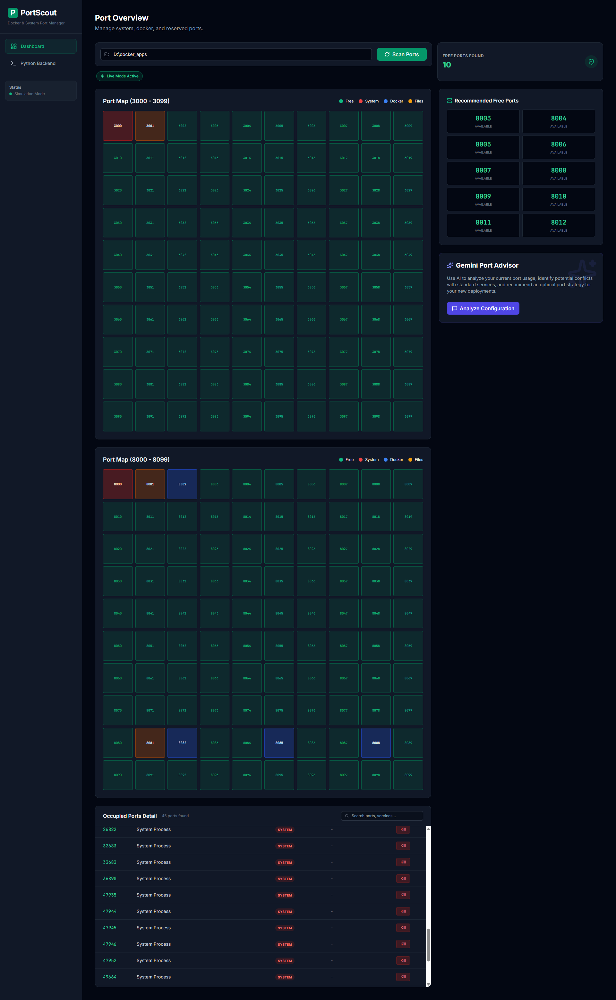

# PortRegistry - Advanced Port Manager

PortRegistry is a powerful utility for developers to manage local ports. It provides a unified view of system processes, Docker containers, and static Docker Compose files, allowing you to identify conflicts and manage your development environment efficiently.

## 🚀 Key Features

*   **Comprehensive Scan**: Detects ports used by:
    *   **System Processes**: Real-time OS process scanning.
    *   **Docker Containers**: Active container mappings.
    *   **Docker Compose Files**: Static analysis of `docker-compose.yml` files on your disk.
*   **Process Management**: **Kill** system processes or **Stop** Docker containers directly from the UI.
*   **Search & Filter**: Instantly find ports by service name, source, or file path.
*   **Desktop App**: Runs as a standalone native window (no browser tab required).
*   **AI Advisor**: Uses Gemini AI to recommend conflict-free port blocks.

## 🛠️ Architecture

This app uses a **React Frontend** for the UI and a **Python Sidecar** for system access.

1.  **Frontend (React)**: Runs in your browser. Visualizes data.
2.  **Backend (Python)**: Runs locally on your machine. Accesses the file system and network interfaces.

## ▶️ How to use the app
1.  Go back to the **Dashboard**.
2.  Toggle the **Live Connection** switch (or wait for auto-detection).
3.  Enter your projects folder path (e.g., `D:\docker_apps`).
4.  Click **Scan Ports**.

## 📦 Installation & Setup

### Prerequisites
*   Node.js (for building the frontend)
*   Python 3.9+ (for the backend agent)
*   Docker Desktop (optional, for container scanning)

### Quick Start (Development)
1.  **Backend**:
    ```bash
    cd back-end
    pip install -r requirements.txt
    python server.py
    ```
2.  **Frontend**:
    ```bash
    npm install
    npm run dev
    ```
    Open `http://localhost:3000`.

## 🛠️ Building the Desktop App

You can package PortRegistry into a single portable `.exe` file that contains both the backend and frontend.

1.  **Build Frontend & Backend**:
    Run the provided PowerShell script (Windows):
    ```powershell
    Set-ExecutionPolicy -Scope Process -ExecutionPolicy Bypass 
    ./build_exe.ps1
    ```
    *Or manually:*
    ```bash
    npm run build
    pyinstaller --name portregistry --noconsole --onefile --add-data "dist;dist" back-end/server.py
    ```

2.  **Run**:
    The executable is created in the `dist/` folder.
    ```bash
    ./dist/portregistry.exe
    ```

## ⚙️ Configuration

PortRegistry supports configuration via `.env` files.

1.  Create a `.env` file next to `server.py` or the executable.
2.  See `.env_example` for available options.

```ini
# Example .env configuration
PORT=8000
# Gemini API Key for AI features (Optional)
GEMINI_API_KEY=your_key_here
```

## ⚠️ Troubleshooting

*   **Docker Error**: Ensure Docker Desktop is running.
*   **"Backend not detected"**: If running in dev mode, ensure `server.py` is running on port 8000.

## Screenshots

