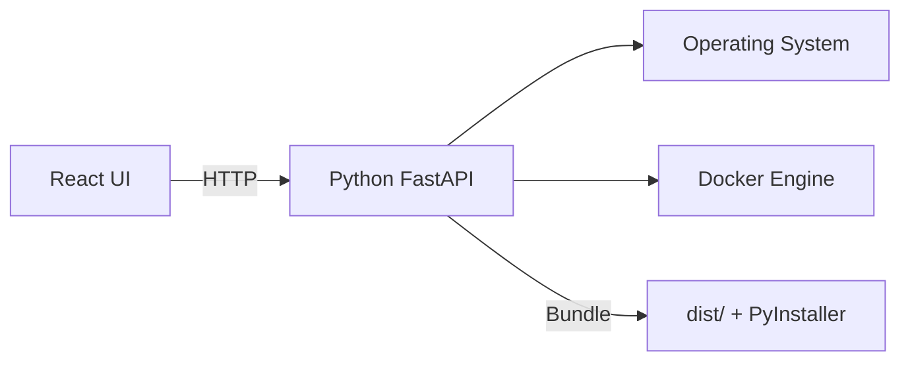

# Architecture

High-level components:

- Frontend (React + Vite): UI, runs in browser during dev and packaged as static files in production.
- Backend (Python + FastAPI): local HTTP API for scanning ports and controlling processes.
- OS & Docker: the backend queries OS process tables and Docker to detect port usage.
- Packager: PyInstaller bundles backend + frontend `dist/` into a single binary. Inno Setup produces Windows installer.

Data flow

1. User interacts with UI (Dashboard) → frontend makes HTTP requests to backend.
2. Backend scans processes and Docker, returns structured JSON of occupied ports and sources.
3. UI renders grids, recommendations and provides actions (kill/stop).

Diagram suggestion
- Add a PlantUML or Mermaid diagram here to show components and ports. Example (Mermaid):

